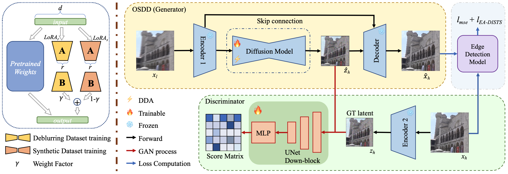
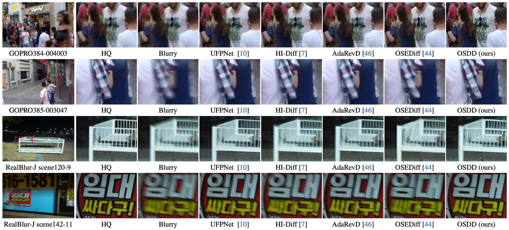
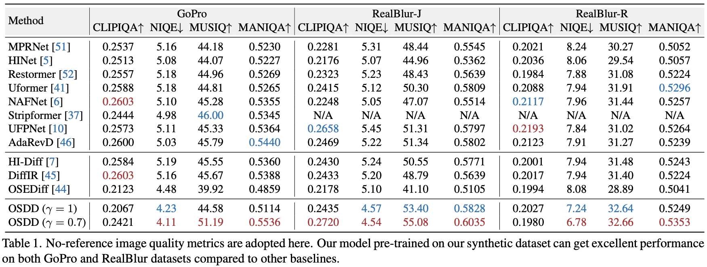
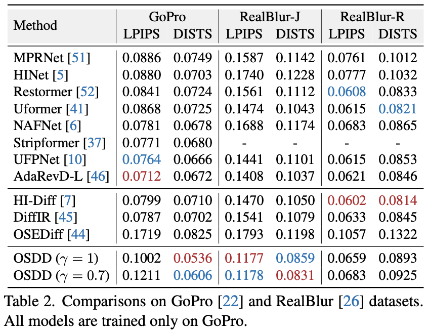

# One-Step Diffusion Model for Image Motion-Deblurring

[Xiaoyang Liu](https://xyliu339.github.io/), [Yuquan Wang](https://github.com/wyq220136), [Zheng Chen](https://zhengchen1999.github.io/), [Jiezhang Cao](https://www.jiezhangcao.com/), [He Zhang](https://sites.google.com/site/hezhangsprinter/), [Yulun Zhang](http://yulunzhang.com/) and [Xiaokang Yang](https://scholar.google.com/citations?user=yDEavdMAAAAJ), "One-Step Diffusion Model for Image Motion-Deblurring", arxiv, 2025.

[](https://github.com/xyLiu339/OSDD/releases) 
[](https://github.com/xyLiu339/OSDD) 
[](https://github.com/xyLiu339/OSDD) 

[[arXiv]()] [[supplementary material]()]

---

> **Abstract:** Currently, methods for single-image deblurring based on CNNs and transformers have demonstrated promising performance. However, these methods often suffer from perceptual limitations, poor generalization ability, and struggle with heavy or complex blur. While diffusion-based methods can partially address these shortcomings, their multi-step denoising process limits their practical usage. In this paper, we conduct an in-depth exploration of diffusion models in deblurring and propose a one-step diffusion model for deblurring (OSDD), a novel framework that reduces the denoising process to a single step, significantly improving inference efficiency while maintaining high fidelity. To tackle fidelity loss in diffusion models, we introduce an enhanced variational autoencoder (eVAE), which improves structural restoration. Additionally, we construct a high-quality synthetic deblurring dataset to mitigate perceptual collapse and design a dynamic dual-adapter (DDA) to enhance perceptual quality while preserving fidelity. Extensive experiments demonstrate that our method achieves strong performance on both full and no-reference metrics.

<div align=center>
    
</div>

<div align=center>
    
</div>

---

### 🔖 TODO
* [ ] Release code and pretrained models.

## 🔗 Contents

- [ ] Datasets
- [ ] Models
- [ ] Training
- [ ] Testing
- [x] [Results](#results)
- [x] [Citation](#citation)
- [ ] [Acknowledgements](#acknowledgements)


## <a name="results"></a>🔎 Results
<details close>
<summary>Quantitative Results on No-Reference Metrics (click to expand) </summary>

- Results in Tab. 1 of the main paper

<p align=left>
  
</p>
</details>

<details close>
<summary>Quantitative Results on Full-Reference Metrics (click to expand) </summary>

- Results in Tab. 2 of the main paper

<p align=left>
  
</p>
</details>

<details open>
<summary>Visual Results on GoPro and RealBlur </summary>

<div align=center>
    
</div>


### <a name="citation"></a>📎 Citation
```
@article{liu2025osdd,
      title={One-Step Diffusion Model for Image Motion-Deblurring}, 
      author={Liu, Xiaoyang and Wang, Yuquan and Chen, Zheng and Cao, Jiezhang and Zhang, He and Zhang, Yulun and Yang, Xiaokang},
      journal={arXiv preprint arXiv:2503.06537}
      year={2025},
}
```

### <a name="acknowledgements"></a>💡 Acknowledgements
[TBD]
